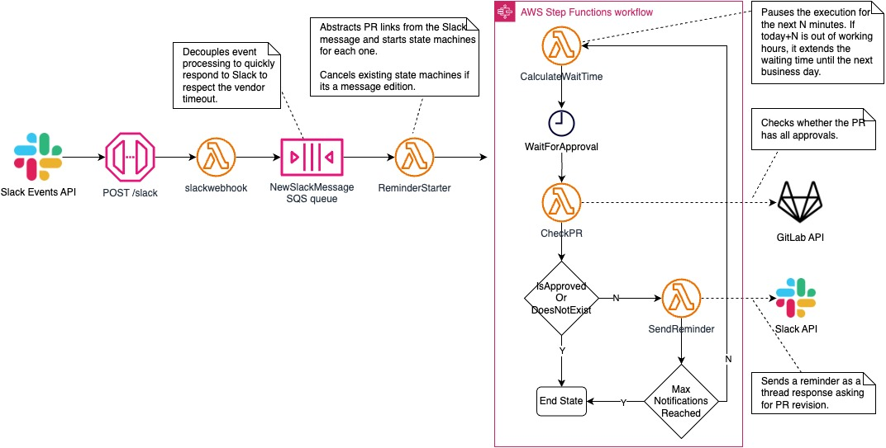

## Description

PRReminder monitors a Slack channel for pull request (PR) messages, initiating a series of steps using AWS Step Functions to ensure timely PR reviews. It decouples event processing using AWS Lambda and SQS, abstracts PR links, and manages state machines for each PR to periodically check their status. The system sends reminders via Slack if PRs remain unapproved within a specified timeframe, respecting business hours and optimizing the review process by integrating seamlessly with Slack and GitLab APIs.

## Repo Structure

- **cdk/**: Contains the Infrastructure as Code (IaC) application, used to automatically deploy all necessary resources.
- **cmd/**: Contains the Lambda function handlers. Each subfolder is a main package that, when compiled, produces a binary executable for the Amazon Linux 2023 runtime. The binary is placed in the `dist` subfolder and named "bootstrap", as required by AWS Lambda.
- **lib/**: Contains shared packages used across the project.
- **local/**: Contains utilities for local development.
  - **.env.example**: A template for the `.env` file, which is git-ignored and provides environment variables for local development.
  - **invoke-worker/**: A Node.js project with scripts to manually invoke Lambda functions locally using the `aws-sdk` package. Each script contains different payloads and targets different Lambda functions. Run `npm install` before using these scripts.

## Local Development

### Requirements

1. Install [Task](https://taskfile.dev/) Runner.
2. Install [CDK CLI](https://docs.aws.amazon.com/cdk/v2/guide/cli.html).
3. Install [SAM CLI](https://docs.aws.amazon.com/serverless-application-model/latest/developerguide/install-sam-cli.html)
4. Download Go modules by running `go get` in the root directory.
5. Install CompileDaemon locally for compilation in watch mode. Run `task install_compiledaemon` in the root. This should create the program file in the `local` directory.

### Flow

Create a `.env` file in `local/` using the `.env.example` file as a guide.

#### HTTP API functions

1. Start the `watch-mode` compilation (See [compilation](#compilation) section) from the lambda function folder. Example: `cd cmd/slackwebhook && task watch-mode`.
2. In another terminal, start the local Web Server powered by the SAM and CDK [integration](https://docs.aws.amazon.com/serverless-application-model/latest/developerguide/serverless-cdk-testing.html). From the root, execute `task start-api`. That exposes a simulated API Gateway server in port `3000`.
3. Send requests to the target lambda function using a local HTTP client like Postman (see [Slack Webhook Payload](#slack-webhook-payload)).

#### Slack Webhook Payload

The `cmd/slackwebhook` function reacts to the following [Slack Events API](https://api.slack.com/apis/events-api) payloads:

- [URL verification handshake](https://api.slack.com/apis/events-api#handshake).
- [message.channels](https://api.slack.com/events/message.channels) to create the state machine that sends PR reminders.
- [message_deleted](https://api.slack.com/events/message/message_deleted) to stop state machines related to PRs mentioned in the deleted message.
- [message_changed](https://api.slack.com/events/message/message_changed) to stop state machines related to PRs mentioned in the previous message and start new ones.

#### Worker-like functions

1. Start the `watch-mode` compilation (See [compilation](#compilation) section) from the lambda function folder. Example: `cd cmd/waittimecalc && task watch-mode`.
2. In another terminal, `cd local/invoke-worker` and create a `.js` script from the template file. There are two template files: `reminderstarter.template` and `index.template`. The former contains an SQS structure and is intended for the function that receives the filtered Slack events by the function `slackwebhook`. `index.template` is intended for the rest of the lambda functions that are part of the state machine.
3. Modify the payload as needed.
4. Invoke the worker by directly executing the `.js` script via `node script.js`.

### Compilation

Before running lambda Functions locally, the Go functions must be compiled. There are two compilation modes: `prod` and `watch-mode`.

- `prod`: From each Lambda function directory, run `task build`. Note that likely, this compilation won't be performed directly by the developer as it's run by the CDK at deployment time. This compilation disables debugging utilities and removes the RPC layer from the `aws-lambda-go` for a [smaller deployment unit](https://aws.amazon.com/blogs/compute/migrating-aws-lambda-functions-from-the-go1-x-runtime-to-the-custom-runtime-on-amazon-linux-2/).
- `watch-mode`: From each Lambda function directory, run `task watch`. This re-compiles the function every time a Go file is modified.
